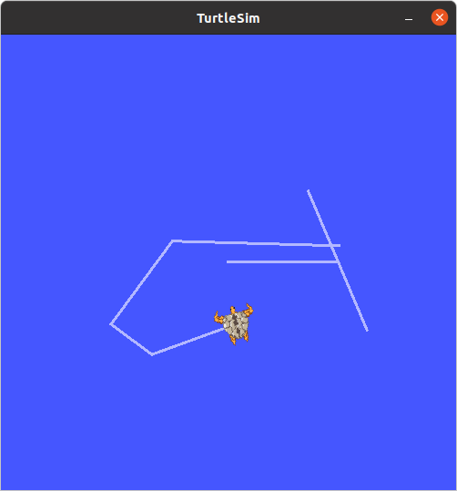
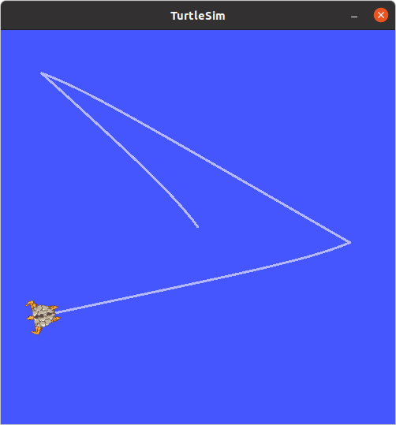
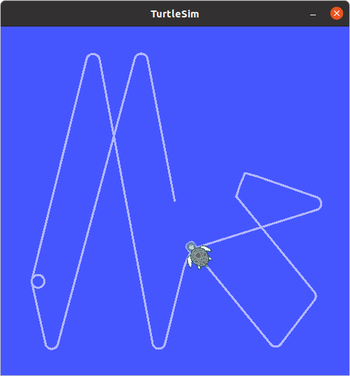

# PDE4430 Coursework
## Introduction

This coursework is focused on completing 5 Tasks using ROS framework. The tasks are as follow;

- Teleoperation using the keyboard, with an option to change movement speed
- Autonomous navigation to any given coordinate in the Turtlesim window
- Avoiding wall collision – Override movement if wall hitting is imminent
- Vacuum cleaning behaviour – Covering the entire window in an efficient manner
- Multiple turtles vacuum cleaning behaviour – 2 is good, 3 or more is great

The nodes to achieve each task were coded using Python and each file name starts with 
the task number for easy identification. For the last task, 4 individuals files were created 
which is responsible for controling 4 robots which will be spawned in the turtlesim.

Each file requires 'Turtlesim' node to be running in order to see the output. 
To make the execution of the programs easy separate launch files were created 
and are available in the 'launch' folder 

Use the following command with the relevent launch file name to execute the nodes

Command:
```bash
  roslaunch <Package_Name> <Launch_file>.launch
```


Eg:
```bash
  roslaunch user_coordinates task_1.launch
```

## Task 1 : Teleoperation for Turtlesim
### Node behaviour
This node is capable of capturing the keyboard inputs from 
the user to control the movements of the turtle in the turtlesim. 

### Node explanation
The program will print the assigned buttons for each activity in the begining. The turtle will move according to the key presses of the user.

Note: Since `getch` library is used to capture key presses, in order to move the turtle continuously press and hold the keys.



`getch` library is used to capture the keyboard inputs from the user and decide the values for 
linear and angular velocities. These values are stored in a `Twist` message and then published
into `cmd_vel` topic to move the turtle.

## Task 2: Autonomous navigation to goal
### Node behaviour
This ROS node will ask the user to enter the `x` and `y` coordinates of the destination and the 
turtle first turn towards the goal and then move towards it.

### Node explanation
The node subscribe to the `pose` topic of the turtle to know the current position and orientation of it in the
turtlesim. The displacement between the goal and the robot is calculated using 'Pythagoras theorem'

```python
 displacement = sqrt(pow(goal_pose.x - currentPoseData.x,2) + pow(goal_pose.y - currentPoseData.y,2))
```

The angle robot needs to turn in order to face the goal is calcutaed using below equation whichis based on trigonometry.

```python
angular.speed = atan2(goal_pose.y-current_pose.y, goal_pose.x-current_pose.x) - current_pose.theta
```

These values are used as the linear velocity and angular velocities this makes the turtle move towards
the goal faster when it is far away from the goal and gradually slows down when 
closing in on the destination coordinates. Once it reaches the goal, the node terminates.
By default the turtle reaches its goal with an accuracy of (+/-)0.2 turtlesim units. This can be 
changed by changing the value of `thresh` global variable in the begining of the code




## Task 3: Wall detection and avoidance
### Node behaviour
This node will stop the turtle from bouncing in to the walls of the turtlesim. When the 
turtle approach a wall, this node will make an evasive maneuver to avoid the collision.

### Node explanation
When the node starts user can either choose to control the turtle manually or make it move
automatically. In order to implement the bounce back with an angle same as the angle of attack 
when its on collition course with the wall, `pose.theta` which represents the orientation of
the turtle in radians is converted into degrees which makes it easier to comprihend during the 
implementation.

This node subscribes to the `pose` topic of the turtle and publishes velocity commands to `cmd_vel` topic
to make the turtle move. The only purpose of the callback function of the subscriber is
to update a global variable `currentPose` which can accessed by the other function to 
determine the position and the orientation of the turtle.



## Task 4: Vacuum cleaning behaviour
### Node behaviour
This node makes the turtle move in a zigzag path to cover the stage area of the 
turtlesim mimicking a vacuum robot cleaning a room.

### Node explanation
The default turtle in the middle of the turtlesim removed via `kill` service provided
with turtlesim and a new turtle is spawned via the service `spawn` at the bottom left 
corner facing right. 

```python
#Deleting default 'turtle1' instance form turtlesim
rospy.wait_for_service('kill')
killer = rospy.ServiceProxy('kill',turtlesim.srv.Kill)
killer("turtle1")

#Spawning new turtle at a corner of the turtlesim named cleaner
rospy.wait_for_service('spawn')
spawner = rospy.ServiceProxy('spawn', turtlesim.srv.Spawn)
spawner(0.5, 0.5, 0,"cleaner")
```

With the new turtle, 3 new topics are created which can be easily identified due to its
naming convention
```bash
$ rostopic list
/cleaner/cmd_vel
/cleaner/color_sensor
/cleaner/pose
/rosout
/rosout_agg
```

Turtle will move towards top edge of the turtlesim following a zigzag path.
In order to achieve this behaviour 4 funcions are mainly being used which focuses on
moving horizontally, moving vertically, turning left and turning right. In order to turn 90 degrees
precisely, the robot will turn slowly to avoid overshooting the limit. The speed of the turtle
is also reduced when it reaches an edge.


## Task 5: Multiple turtles vacuum cleaning behaviour
### Node behaviour
The turtlesim stage is traversed by 4 turtles mimicking the behaviour of vacuum cleaning robots
cleaning a room

### Node explanation
The same code used in the task 4 is reused in here. Instead of using one node to 
control all 4 turtles, 4 individual nodes are created to control each turtle.
In each node the spwning position of the robot is changed to spwan turtles in 
different places in the turtlesim stage.


## Custom helper functions used
Name: **inThreshRange(value,threshold)**


```python
def inThreshRange(vals,thresh):
    val = abs(vals)
    if (val-thresh)<val and val<(val+thresh):
        return True
    else:
        return False
```

Output: Return `True` or `False` if the value is in between (value-threshold)
or (value+threshold). 

Useful when checking `Pose` information of the turtle as 
they are calculated to many decimal places. Since 5.0 is not equal 5.000001, it 
can cause errors in the code if used in conditions like `if value==5`. When moving and turning these
values can be easily overshoot. 

Eg: `if value == inThreshRange(5,05)` -> will return `True` if the value 
reaches any where between `4.95` to `5.05`

This gives `value` a wiggle room to be `True`.


Name: **clamp_vel(current_speed,max_speed,min_speed)**
```python
def clamp_vel(speed, max, min):
    if speed>=max:
        return max
    elif speed<=min:
        return min
    return speed
```
Output: Returns `max`, `min` or the `speed` value it self.

`max` value will be returned if the speed is greater than or equal to `max` and will return 
`min` value if the speed is less than or equal the `min` value. The `speed` value will
be returned as it is if the `speed` is in between the `max` and `min` range.

When using displacement as the linear velocity, if the distance
between turtle and the goal is higher, the speed will be very high and will be very 
slow when reaching the goal. To avoid this problem above function can be used
to have a minimum and maximum linear velocity.


Name: **normalizedDegrees(degree)**
```python
def normalizedDegrees(degree):
    if degree==0:
        return 0.1
    if isBetween(0,degree,180):
        return degree
    if isBetween(-180,degree,0):
        return 180+(180-abs(degree))
```
Output: Returns a value between 0 to 359 when theta is given

This is usefull to understand the orientation of the turtle instead of using
 radians which rang from `0->3.14` and `(-3.14)->0`. By having a value between `0` and `359`
 it is easy to understand which direction the turtle is facing.

Name: **heading360(degree)**

```python
def heading360(deg):
    if isBetween(deg,0,44) or isBetween(deg,316,360):
        return 0
    if isBetween(deg,45,134):
        return 90
    if isBetween(deg,135,224):
        return 180
    if isBetween(deg,225,314):
        return 270
```
Output: Returns a number out of `0,90,180,270` when theta is given in degrees.

This function is used to determine the current orientation of the turtle 
interms of degrees. The numbers `0,90,180,270` corresponds the directions
`right,top,left,bottom` directions.
